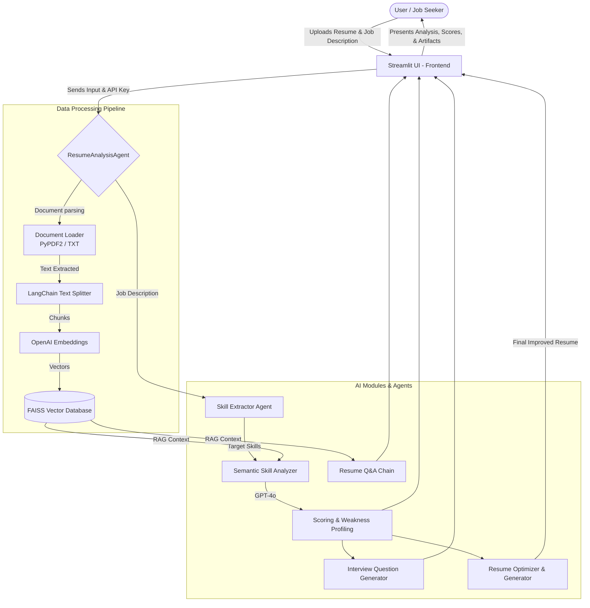

# Avni - Recruitment Agent 🚀

Avni is an intelligent recruitment and career assistance agent built using **Streamlit**, **LangChain**, and **OpenAI**. It is designed to act as an advanced AI assistant for both recruiters evaluating candidates and job seekers looking to optimize their resumes for specific roles.

## 🌟 Key Features

Avni provides a comprehensive suite of tools to analyze and interact with resumes:

- **Resume Analysis**: Upload your resume (PDF/TXT) and evaluate it against standard role requirements (e.g., AI/ML Engineer, Full Stack Developer) or a Custom Job Description. It scores your profile semantically and identifies missing skills.
- **Resume Q&A**: Ask any context-driven questions directly about the uploaded resume, powered by Retrieval-Augmented Generation (RAG).
- **Interview Preparation**: Automatically generate personalized interview questions based on the candidate's exact strengths and weaknesses. You can select specific question types (e.g., Coding, Theoretical, System Design) and difficulty levels.
- **Actionable Improvements**: Get deep insights on why a resume is falling short on certain skills, with highly specific, paragraph-by-paragraph suggestions and "before/after" examples.
- **Resume Generation**: Regenerate a highly optimized version of your resume tailored to your target job, filling in the gaps with intelligently expanded context.

## 🏗️ Architecture Design

Below is the high-level system architecture of Avni:



### How it Works:
1. **Frontend (Streamlit)**: App handles file uploads, user configuration (API Keys), and renders a beautiful UI across 5 modular tabs.
2. **Text Processing**: Resumes are converted into raw text via `PyPDF2` and then cleanly chunked using `RecursiveCharacterTextSplitter`.
3. **Vector Embeddings (FAISS)**: The chunks are processed via OpenAI Embeddings and stored in a FAISS vector store, forming the memory backbone of the RAG system.
4. **Intelligent Retrieval**: When a job description is provided, a skill-extraction LLM identifies the target requirements. The `RetrievalQA` semantic similarity engine evaluates how well the resume content matches these target skills, assigning an automated score.
5. **Generative Feedback**: Weaknesses are passed into another GPT-4o chain that fabricates actionable advice, while the resume generation agent weaves those missing attributes back into a newly crafted resume using strict context boundaries.

## 🚀 Getting Started

### Prerequisites

You will need the following installed:
- Python 3.8+
- An active OpenAI API Key (using the `gpt-4o` model space)

### Installation

1. Clone this repository to your local machine.
2. Install the necessary Python dependencies:
   ```bash
   pip install -r requirements.txt
   ```
3. Run the Streamlit application:
   ```bash
   streamlit run app.py
   ```
4. Access the web interface at `http://localhost:8501`. Enter your OpenAI API key in the sidebar to begin.

## 🛠️ Technology Stack

- **UI Framework**: [Streamlit](https://streamlit.io/)
- **LLM Orchestration**: [LangChain](https://www.langchain.com/)
- **Model Provider**: [OpenAI](https://openai.com/) (GPT-4o, Embeddings)
- **Vector Database**: [FAISS](https://faiss.ai/) (Facebook AI Similarity Search)
- **Document Processing**: PyPDF2
